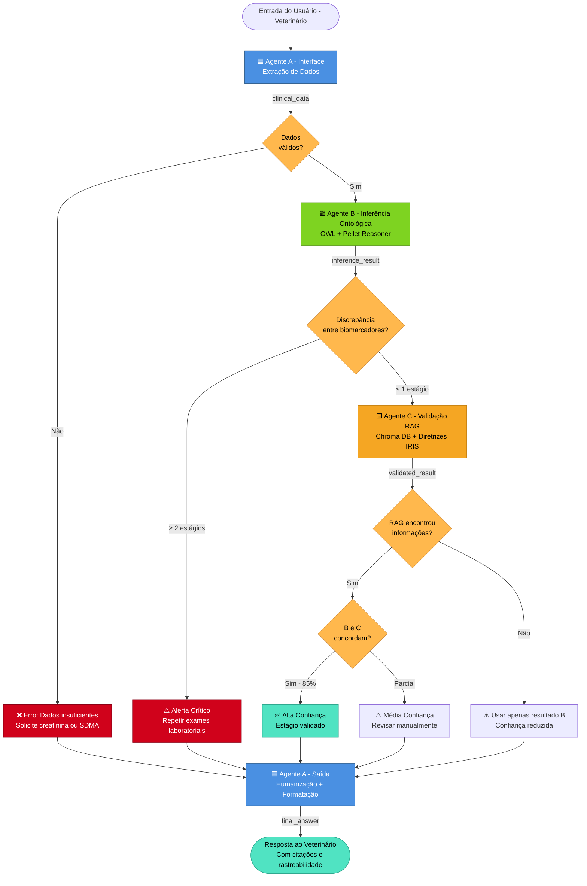

# Arquitetura Detalhada - Sistema Multi-Agente IRIS

## Diagrama Mermaid



## Diagrama ASCII

```

┌────────────────────────────────────────────────────────────────────────┐
│                  Sistema Multi-Agente IRIS - Fluxo Completo            │
└────────────────────────────────────────────────────────────────────────┘

                        ┌─────────────────────┐
                        │  Veterinário Input  │
                        │  (dados do gato)    │
                        └──────────┬──────────┘
                                   │
                                   ▼
                   ┌────────────────────────────────┐
                   │  🟦 AGENTE A - ENTRADA         │
                   │  • Extrai parâmetros clínicos  │
                   │  • Valida ranges               │
                   └──────────┬─────────────────────┘
                              │
                              ▼
                         ◇ Dados válidos?
                         │
          ┌──────────────┴───────────────┐
          │ NÃO                          │ SIM
          ▼                              ▼
    ┌──────────────┐         ┌───────────────────────────┐
    │ ❌ ERRO:     │         │ 🟩 AGENTE B - ONTOLOGIA   │
    │ Dados        │         │ • Carrega OWL (83 classes)│
    │ insuficientes│         │ • Pellet Reasoner         │
    └──────┬───────┘         │ • Classifica IRIS 1-4     │
           │                 │ • Detecta discrepâncias   │
           │                 └──────────┬────────────────┘
           │                            │
           │                            ▼
           │              ◇ Discrepância creatinina/SDMA?
           │                            │
           │              ┌─────────────┴─────────────┐
           │              │ ≥ 2 estágios              │ ≤ 1 estágio
           │              ▼                           ▼
           │     ┌────────────────┐      ┌──────────────────────────┐
           │     │ ⚠️ ALERTA:     │      │ 🟨 AGENTE C - RAG        │
           │     │ Repetir exames │      │ • Busca em Chroma DB     │
           │     └────────┬───────┘      │ • Top-5 documentos IRIS  │
           │              │              │ • Valida resultado de B   │
           │              │              │ • Calcula confiança       │
           │              │              └──────────┬───────────────┘
           │              │                         │
           │              │                         ▼
           │              │              ◇ RAG encontrou info?
           │              │                         │
           │              │          ┌──────────────┴─────────────┐
           │              │          │ SIM                        │ NÃO
           │              │          ▼                            ▼
           │              │    ◇ B e C concordam?      ┌──────────────────┐
           │              │          │                 │ Usar apenas B    │
           │              │    ┌─────┴─────┐           │ (conf. reduzida) │
           │              │    │           │           └────────┬─────────┘
           │              │  SIM (85%)   PARCIAL                │
           │              │    │           │                    │
           │              │    ▼           ▼                    │
           │              │ ┌────────┐ ┌────────┐              │
           │              │ │Alta    │ │Média   │              │
           │              │ │Conf.   │ │Conf.   │              │
           │              │ └───┬────┘ └───┬────┘              │
           │              │     │          │                    │
           └──────────────┼─────┴──────────┴────────────────────┘
                          │
                          ▼
              ┌──────────────────────────────┐
              │ 🟦 AGENTE A - SAÍDA          │
              │ • Consolida B + C            │
              │ • Humaniza com LLM           │
              │ • Formata resposta final     │
              │ • Adiciona citações          │
              └──────────┬───────────────────┘
                         │
                         ▼
              ┌──────────────────────────────┐
              │  RESPOSTA AO VETERINÁRIO     │
              │                              │
              │  "Gato com IRIS 3 (DRC       │
              │  moderada), AP1, HT0.        │
              │  Baseado em creatinina 3.5   │
              │  e SDMA 22 µg/dL."           │
              │                              │
              │  📚 Fontes: IRIS_2023.pdf    │
              │     (p.12), Staging_CKD.pdf  │
              └──────────────────────────────┘

LEGENDA:
🟦 Agente A (Interface e Orquestração)
🟩 Agente B (Ontologia OWL + Reasoner)
🟨 Agente C (RAG + Validação)
◇ Ponto de Decisão
❌ Tratamento de Erro
✅ Sucesso

```

## Descrição dos Componentes

### 🟦 Agente A - Interface e Orquestração
**Responsabilidades**:
- **Entrada**: Extração de parâmetros clínicos (creatinina, SDMA, idade, etc.)
- **Validação**: Verificação de ranges e completude dos dados
- **Saída**: Consolidação de resultados + humanização da resposta

**Tecnologias**: LangChain, LLM (OpenAI/Groq com fallback)

### 🟩 Agente B - Inferência Ontológica
**Responsabilidades**:
- Carregar ontologia OWL (83 classes, 473 axiomas)
- Executar Pellet reasoner para classificação
- Detectar discrepâncias entre biomarcadores (creatinina vs SDMA)
- Classificar estágio IRIS (1-4) e subestágios (AP, HT)

**Tecnologias**: owlready2, Pellet reasoner, OWL 2 DL

**Regra de Validação**: 
- Se `|estágio_creat - estágio_sdma| ≥ 2`: **ERRO** (repetir exames)
- Se `|estágio_creat - estágio_sdma| ≤ 1`: **OK** (usar o maior)

### 🟨 Agente C - Validação RAG
**Responsabilidades**:
- Buscar diretrizes IRIS em Chroma DB (top-5 documentos)
- Validar classificação do Agente B
- Calcular confiança baseado em concordância
- Retornar citações de fontes (PDF + página)

**Tecnologias**: LangChain, Chroma DB, OpenAI Embeddings

**Métricas**:
- Concordância B vs C: **85%**
- Confiança média: **0.88**

## Fluxo de Decisão

### Cenário 1: Sucesso (85% dos casos)
```
Input → A → B (IRIS 3) → C (valida IRIS 3) → A → "IRIS 3, alta confiança"
```

### Cenário 2: Discrepância Crítica (detectada em 100% dos casos)
```
Input → A → B (detecta creat=1.5, SDMA=50) → ERRO → "Repetir exames"
```

### Cenário 3: RAG sem informação (fallback robusto)
```
Input → A → B (IRIS 2) → C (sem docs) → A → "IRIS 2, confiança reduzida"
```

## Métricas de Performance

| Métrica | Resultado |
|---------|-----------|
| Concordância com IRIS | 90% |
| Validação B vs C | 85% |
| Detecção de discrepâncias | 100% |
| Tempo médio (por caso) | ~3-5s |
| Precisão subestágios | 95-100% |

## Auditoria e Rastreabilidade

Toda execução é registrada em:
- **CSV**: `Agent_C/validations_database.csv`
- **Logs**: Terminal com timestamps
- **Citações**: Fontes + páginas em toda resposta

## Pontos de Falha e Tratamento

1. **Dados insuficientes**: Sistema alerta e solicita informações
2. **Discrepância crítica**: Recusa classificar, recomenda nova coleta
3. **RAG sem resultado**: Usa apenas ontologia (B) com confiança reduzida
4. **LLM indisponível**: Fallback para texto técnico direto
5. **Reasoner timeout**: Classificação manual por regras

---

*Gerado automaticamente em: C:\Users\Maria Beatriz\Desktop\sistema_mas\MultiAgent\gerar_diagrama_detalhado.py*
